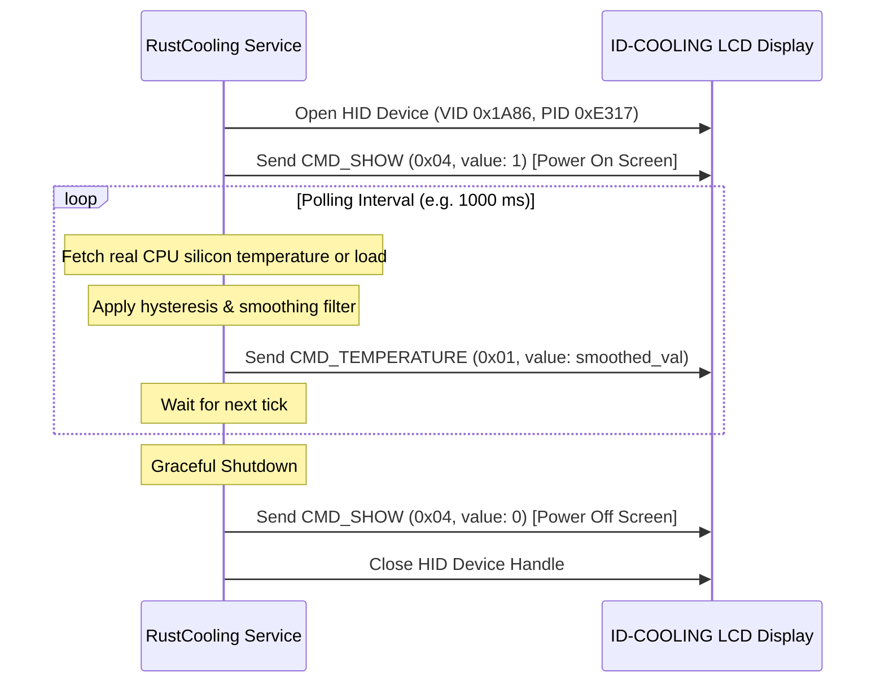

# ID-COOLING LCD Display Protocol & Architecture Memo (RustCooling)

Technical architectural memo and guide for developing, maintaining, and extending **RustCooling** — an ultra-lightweight, zero-bloat, cross-platform LCD display controller for **ID-COOLING FX Series** liquid coolers (FX240, FX280, FX360) and compatible WCH-based AIO hardware.

---

## 1. Hardware Identification (USB HID)

- **Vendor ID (VID):** `0x1A86` (QinHeng Electronics / WCH)
- **Product ID (PID):** `0xE317`
- **Device Class:** USB HID (Human Interface Device)
- **Report Length:** 64 bytes (on Windows, Win32 HID API / `WriteFile` prepends Report ID `0x00` -> 65 bytes total).
- **I/O Mode:** Synchronous I/O (Non-overlapped).

---

## 2. Hardware Reality & Protocol Specification

### Hardware Reality
The ID-COOLING FX pump cap houses an ultra-simple microcontroller driving a **2-digit 7-segment display** with a fixed static Celsius (°C) indicator.
- The hardware controller **only physically renders command `0x01`** (numeric value) on the 7-segment display.
- Opcodes `0x02` (Frequency) and `0x03` (CPU Load) were legacy vendor placeholders and do not render distinct metrics on the physical panel. RustCooling routes all telemetry modes (temperature, CPU load, and synthetic metrics) through `CMD_TEMPERATURE` (`0x01`).

### Frame Format (64 Bytes)

Each HID output report consists of 64 bytes:

| Byte(s) | Field Name | Value / Description |
| :--- | :--- | :--- |
| `0` | Header 1 | `0x55` |
| `1` | Header 2 | `0xBB` |
| `2` | Data Length | `0x02` (payload value length in bytes) |
| `3` | Command (`cmd`) | Command opcode (see table below) |
| `4` | Value High (`valHi`) | `(value >> 8) & 0xFF` (Big-Endian high byte) |
| `5` | Value Low (`valLo`) | `value & 0xFF` (Big-Endian low byte) |
| `6` | Checksum (`cksum`) | `(byte[0] + byte[1] + byte[2] + byte[3] + byte[4] + byte[5]) & 0xFF` |
| `7..63` | Padding | 57 zero bytes (`0x00`) |

### Command Table

| Command | Hex | Description | Value Format (`u16`) |
| :--- | :---: | :--- | :--- |
| `CMD_TEMPERATURE` | `0x01` | Renders number on the 7-segment display | Numeric value `0`–`99` (clamped up to `199`) |
| `CMD_SHOW` | `0x04` | Powers display panel on or off | `1` = Screen On (`0x0001`), `0` = Screen Off (`0x0000`) |

### Checksum Algorithm

The checksum is the sum of the first 6 bytes modulo 256:

```rust
pub fn calculate_checksum(header1: u8, header2: u8, len: u8, cmd: u8, val_hi: u8, val_lo: u8) -> u8 {
    (header1 as u16 + header2 as u16 + len as u16 + cmd as u16 + val_hi as u16 + val_lo as u16) as u8
}
```

---

## 3. Hardware Lifecycle & Communication Flow



### Timing & Reliability Rules:
1. **Deduplication:** When values do not change across polling cycles, duplicate HID packets can be skipped to minimize USB bus traffic.
2. **Auto-Reconnect:** If `WriteFile` or `hidapi::write` fails (e.g., USB sleep, unplug), the device handle is dropped, and the monitor enters a non-blocking reconnect loop (retrying every 1.5 seconds).
3. **High Process Priority:** On Windows, process priority is boosted to `HIGH_PRIORITY_CLASS` or `ABOVE_NORMAL_PRIORITY_CLASS`, and the background monitor thread runs at `THREAD_PRIORITY_HIGHEST` to guarantee jitter-free packet dispatch.

---

## 4. Telemetry Architecture

### Windows (LibreHardwareMonitor Ring 0 Kernel Driver):
- **Driver:** Embedded LibreHardwareMonitor kernel driver (`assets/driver/WinRing0x64.sys`).
- **Storage:** Extracted portably directly alongside `RustCooling.exe`.
- **Service Control Manager:** Registered as an on-demand Windows kernel driver service (`WinRing0_1_2_0`, `SERVICE_KERNEL_DRIVER`, `SERVICE_DEMAND_START`), automatically started when needed and stopped/unloaded from kernel memory upon application exit (including console termination signals).
- **MSR Queries (`IOCTL_OLS_READ_MSR = 0x9C402084`):**
  - `0x1A2` (`IA32_TEMPERATURE_TARGET`): Extracts TjMax from bits 16–23 (default 100°C).
  - `0x19C` (`IA32_THERM_STATUS`): Read per-core Digital Thermal Sensor (DTS) temperature (`TjMax - delta`). Pinned across logical threads using `SetThreadAffinityMask`.
  - `0x1B1` (`IA32_PACKAGE_THERM_STATUS`): Reads CPU Package thermal sensor.
- **UAC Elevation:** If not running as Administrator, user clicks "Update", triggering `ShellExecuteW(..., "runas", exe, "--install-driver", ..., SW_HIDE)` to register the service silently.
- **Fallback:** If driver is not accessible, gracefully falls back to `sysinfo` ACPI thermal sensors.

### Linux (Driverless Native Kernel sysfs):
- **Temperature:** Scanned directly via `/sys/class/hwmon/hwmon*/temp*_input` matching driver labels (`k10temp`, `zenpower`, `coretemp`, `Tctl`, `Tdie`, `Package id 0`). Fallback: `/sys/class/thermal/thermal_zone*/temp`.
- **CPU Load:** Calculated from deltas in `/proc/stat` (`user`, `nice`, `system`, `idle`, `iowait`, etc.).
- **Permissions:** Zero root rights required. Bundled `99-idcooling.rules` grants user access to VID `0x1A86`, PID `0xE317`.

---

## 5. UI Architecture & Typography

- **Framework:** Slint 1.9 with FemtoVG OpenGL hardware-accelerated rendering.
- **Window Dimensions:** Exactly **360 x 360 px**, centered upon launch.
- **Fonts & Typography:**
  - Standard (Latin/Cyrillic): Embedded **Unbounded** (SIL Open Font License 1.1).
  - Chinese: Embedded **Google Noto Sans SC Bold** (SIL Open Font License 1.1) to ensure crisp CJK ideograms without tofu squares or layout clipping.
- **Localizations:** Full runtime localization in 5 languages:
  - English (`en`), Russian (`ru`), Simplified Chinese (`zh`), German (`de`), French (`fr`).
- **First-Run Wizard:** An activation view blocks interaction on first launch until administrator driver registration is confirmed.

---

## 6. Memory & Performance Benchmarks

- **Active Window RAM:** **~12 – 14 MB** (physical working set).
- **System Tray RAM:** **< 3 MB** (~1.1 – 2.5 MB).
- **Headless CLI Daemon:** **~2 – 4 MB** (`--daemon`).
- **Background CPU Usage:** **0.0%** (event-driven timer loop).

---

## 7. System Tray & Window Management

- **Event Handling:** Built on `tray-icon` and `muda` with native Win32/X11 message hooks. Dispatched directly through `slint::invoke_from_event_loop` for **0 ms interaction latency**.
- **Window Restoration:** On Windows, restoring from tray calls `SW_RESTORE`, `SetForegroundWindow`, and `BringWindowToTop` to guarantee the window surfaces immediately without getting trapped in the background.

---

## 8. Configuration & Portability

- **Portable File Storage:** `config.json` and `WinRing0x64.sys` are saved directly in the folder containing `RustCooling.exe`. The application never writes to `%APPDATA%`.
- **Autostart Integration:** Tied to the real system state:
  - Windows: `HKCU\Software\Microsoft\Windows\CurrentVersion\Run` (`auto-launch` crate).
  - Linux: `~/.config/autostart/RustCooling.desktop`.
- **Temperature Smoothing:** Configurable exponential moving average (alpha) + deadband hysteresis filter (0–100% / 0–5°C deadband) to eliminate 7-segment jitter.

---

## 9. Architectural Rationale: ARM Architecture Omission

Support for ARM architectures (Windows on ARM, Linux aarch64) is **intentionally omitted**:
- ID-COOLING FX Series AIO coolers are desktop cooling units designed exclusively for standard desktop motherboard sockets: Intel (LGA1700/1851/1200) and AMD (AM4/AM5) with internal 9-pin USB headers.
- Desktop motherboards with ARM sockets and AIO cooler mountings do not exist on the consumer market (Snapdragon X processors are soldered directly onto laptop motherboards).
- Omitting ARM keeps the codebase free of unreachable dead code and reduces build matrix complexity.

---

## 10. Codebase Structure

```
RustCooling/
├── assets/
│   ├── driver/
│   │   └── WinRing0x64.sys          # Embedded LibreHardwareMonitor kernel driver
│   ├── fonts/
│   │   ├── Unbounded-Bold.ttf       # Brand typography (Latin & Cyrillic)
│   │   └── NotoSansSC-Bold.ttf      # CJK typography (Simplified Chinese)
│   └── icons/                       # Multi-resolution icons (16x16 up to 256x256, .ico, .rgba)
├── i18n/                            # Localization files (en.json, ru.json, zh.json, de.json, fr.json)
├── packaging/                       # Linux udev rules, .desktop files, install scripts
├── src/
│   ├── config/                      # Portable config serialization and directory resolution
│   ├── hid/                         # USB HID communication via hidapi
│   ├── i18n/                        # Runtime localization provider
│   ├── protocol/                    # HID packet construction and checksum calculation
│   ├── service/                     # Background monitor service, hysteresis smoothing, animations
│   ├── telemetry/
│   │   ├── mod.rs                   # TelemetryProvider trait and factory
│   │   ├── driver.rs                # WinRing0 kernel driver loader, SC Manager & MSR reader
│   │   ├── windows.rs               # Windows telemetry coordinator (MSR + sysinfo fallback)
│   │   └── linux.rs                 # Linux sysfs / hwmon telemetry reader
│   ├── tray/                        # System tray icon, context menu, and event hooks
│   └── main.rs                      # Entry point, Slint UI bindings, CLI args, memory trimming
├── ui/
│   └── app.slint                    # Slint UI definitions (Monitor, Settings, Activation screens)
├── Cargo.toml                       # Dependencies and release profiles
├── AGENTS.md                        # Architecture memo and developer documentation
└── README.md                        # Project documentation and guide
```

---

## 11. GitHub Release Formatting Standard

All GitHub releases across the repository **must strictly adhere to the following unified English format**. Never include filler phrases, extraneous prose, or unlinked changelogs.

### Release Body Template

```markdown
### What's New
- Concise bulleted summary of new features, optimizations, and hardware behavior fixes.
- Second key change.
- Third key change.

[Full Changelog](https://github.com/Qyzom/RustCooling/commits/main)

### Release Assets
- **`RustCooling.exe`** — Portable standalone executable for Windows 10/11 x64 (no installation required, ready to run).
- **`RustCooling-X.X.X.exe`** — Versioned standalone executable for Windows 10/11 x64.
- **`RustCooling-X.X.X.AppImage`** — Standalone universal AppImage for all x86_64 Linux distributions.
- **`RustCooling-X.X.X.deb`** — Debian, Ubuntu, and Linux Mint package with automatic udev rules configuration.
- **`RustCooling-X.X.X.tar.gz`** — Universal archive for Arch Linux, Fedora, and other distributions with `install.sh` script.
```

### Release Rules & Workflow:
1. **Language:** Always 100% in **English**.
2. **"What's New" Section:** Keep it concise and bulleted (3–7 bullets maximum). Focus on tangible user-facing value and low-level improvements.
3. **Changelog Link:** The link between the sections must strictly be `[Full Changelog](https://github.com/Qyzom/RustCooling/commits/main)`. Do not add trailing or leading filler sentences.
4. **Asset Descriptions:** Every non-source-code binary asset attached to the release must be explicitly described with its target OS, architecture, and deployment method. Do not describe automatic GitHub source code archives (`.zip` / `.tar.gz`).
5. **Asset Naming Convention:**
   - Windows default binary: `RustCooling.exe`
   - Windows versioned binary: `RustCooling-X.X.X.exe`
   - Linux AppImage: `RustCooling-X.X.X.AppImage` (generated automatically by GitHub Actions CI)
   - Debian/Ubuntu installer: `RustCooling-X.X.X.deb` (generated automatically by GitHub Actions CI)
   - Generic Linux archive: `RustCooling-X.X.X.tar.gz` (generated automatically by GitHub Actions CI)
6. **Publishing Process:**
   - Bump version in `Cargo.toml` and verify `cargo test` + `cargo clippy`.
   - Build Windows release binary via `cargo build --release`.
   - Create Git tag: `git tag -a vX.X.X -m "RustCooling X.X.X"` and push: `git push origin main --tags`.
   - Create GitHub release:
     ```bash
     gh release create vX.X.X \
       RustCooling.exe \
       RustCooling-X.X.X.exe \
       --title "RustCooling X.X.X" \
       --notes-file release_notes.md
     ```
   - GitHub Actions (`.github/workflows/release.yml`) triggers on the pushed tag, compiles Linux `.AppImage`, `.deb`, and `.tar.gz`, and automatically attaches them to the release via `gh release upload ... --clobber`.

