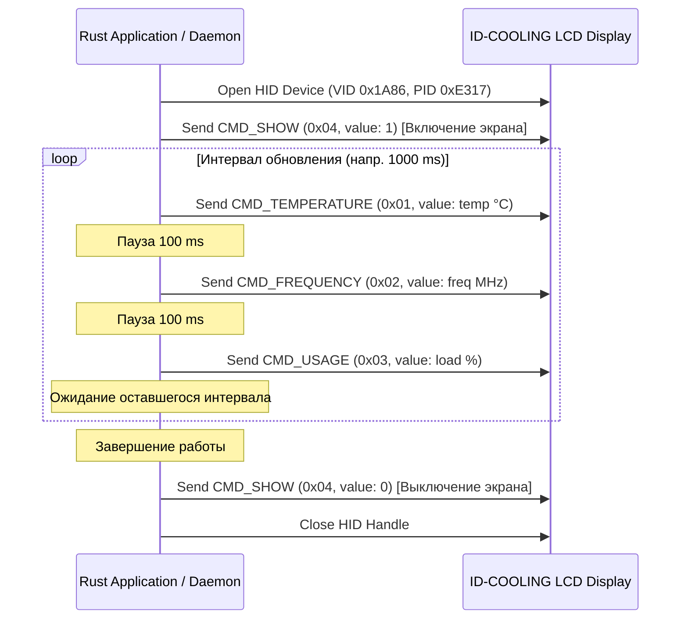

# ID-COOLING LCD Display Protocol & Architecture Memo (Rust Rewrite)

Памятка для разработки легковесного Rust-приложения/демона для управления LCD-экранами систем жидкостного охлаждения **ID-COOLING FX Series** (и совместимых СЖО на контроллерах WCH).

---

## 1. Аппаратная идентификация (USB HID)

- **Vendor ID (VID):** `0x1A86` (QinHeng Electronics / WCH)
- **Product ID (PID):** `0xE317`
- **Класс устройства:** USB HID (Human Interface Device)
- **Длина отчета (Report Length):** 64 байта (на Windows при `WriteFile` / HID API добавляется Report ID `0x00` -> 65 байт).
- **Режим ввода/вывода:** Синхронный I/O (Non-overlapped на Windows).

---

## 2. Структура протокола и кадров (Frame Format)

Каждый пакет состоит из **64 байт**:

| Байт(ы) | Имя поля | Значение / Описание |
| :--- | :--- | :--- |
| `0` | Header 1 | `0x55` |
| `1` | Header 2 | `0xBB` |
| `2` | Data Length | `0x02` (длина полезной нагрузки: 2 байта значения) |
| `3` | Command (`cmd`) | Код команды (см. таблицу команд ниже) |
| `4` | Value High (`valHi`) | `(value >> 8) & 0xFF` (старший байт значения, Big-Endian) |
| `5` | Value Low (`valLo`) | `value & 0xFF` (младший байт значения) |
| `6` | Checksum (`cksum`) | `(byte[0] + byte[1] + byte[2] + byte[3] + byte[4] + byte[5]) & 0xFF` |
| `7..63` | Padding | 57 нулевых байтов (`0x00`) |

### Таблица команд (`cmd`)

| Команда | Hex | Описание | Формат значения (`value`, `u16`) |
| :--- | :--- | :--- | :--- |
| `CMD_TEMPERATURE` | `0x01` | Вывод температуры CPU на дисплей | Температура в °C (целое число, напр. `45` -> `0x002D`) |
| `CMD_FREQUENCY` | `0x02` | Вывод тактовой частоты CPU | Частота в МГц (напр. `4200` -> `0x1068`) |
| `CMD_USAGE` | `0x03` | Вывод процента загрузки CPU | Процент от 0 до 100 (напр. `35` -> `0x0023`) |
| `CMD_SHOW` | `0x04` | Включение / выключение дисплея | `1` = включить / отображать (`0x0001`), `0` = выключить (`0x0000`) |

---

## 3. Алгоритм контрольной суммы (Checksum)

Контрольная сумма — это сумма первых 6 байт пакета по модулю 256:

```rust
fn calculate_checksum(header1: u8, header2: u8, len: u8, cmd: u8, val_hi: u8, val_lo: u8) -> u8 {
    (header1 as u16 + header2 as u16 + len as u16 + cmd as u16 + val_hi as u16 + val_lo as u16) as u8
}
```

---

## 4. Жизненный цикл работы с экраном



### Важные нюансы таймингов:
1. **Каскадная отправка (Staggering):** Не следует слать команды температуры, частоты и загрузки одновременно в одном такте. Рекомендуемый сдвиг между кадрами — **100 мс**, чтобы микроконтроллер дисплея успевал обработать и отрисовать каждый параметр.
2. **Дедупликация значений:** Если значение (температура/частота/загрузка) не изменилось с предыдущей отправки, отправку этого конкретного кадра можно пропускать для экономии USB-трафика.
3. **Автоматическое переподключение:** При ошибке `WriteFile` / `hidapi::write` дескриптор устройства закрывается, и сервис переходит в цикл попыток переподключения (раз в 1-2 секунды).

---

## 5. Сбор телеметрии в Rust

### Linux:
- **Температура:** Парсинг `/sys/class/hwmon/hwmon*/temp*_input` (с проверкой драйверов `k10temp`, `zenpower`, `coretemp`, `acpitz` и меток `Tctl`, `Tdie`, `Package id 0`, `CPU`). Фоллбэк: `/sys/class/thermal/thermal_zone*/temp`.
- **Загрузка CPU:** Чтение и вычисление дельты времён (`user`, `nice`, `system`, `idle`, `iowait`, `irq`, `softirq`, `steal`) из первой строки `/proc/stat`.
- **Частота CPU:** Чтение `/proc/cpuinfo` (`cpu MHz`) или `/sys/devices/system/cpu/cpufreq/policy*/scaling_cur_freq`.

### Windows:
- Кроссплатформенный крейт **`sysinfo`** (для CPU load и частоты, а также базовых температур).
- Дополнительно для точных температур CPU (Package/Tctl): WMI (`MSAcpi_ThermalZoneTemperature`), Windows Performance Counters (PDH) или Ring0 драйвер (WinRing0 / LibreHardwareMonitor wrapper / WinRing0-Rust).

---

## 6. Рекомендации по Rust-стеку

1. **HID коммуникация:**
   - Крейт `hidapi` (обертка над C `hidapi`) или чистый `windows-sys` / `windows` для Win32 HID API и `hidraw` для Linux.
2. **Системные метрики:**
   - `sysinfo` + кастомный hwmon ридер для Linux + WMI/PDH для Windows.
3. **CLI / Демон / GUI:**
   - **CLI / Headless Daemon:** `tokio` (или простой синхронный цикл со `std::thread`), `clap` для аргументов командной строки.
   - **GUI (опционально):** `egui` / `eframe` или `iced` / `slint` (для ультра-легковесного GUI с потреблением ОЗУ < 10-15 МБ).
   - **Трей (SysTray):** `tray-icon` или `ksni` (Linux) / `tray-item`.
