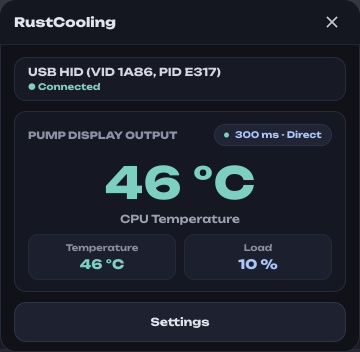
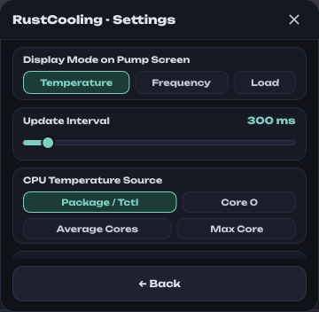
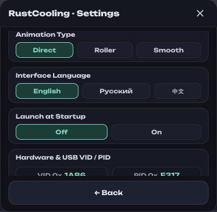
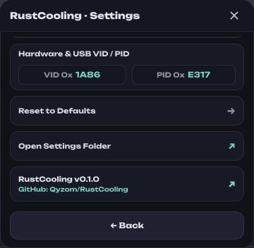

<div align="center">


# RustCooling

**Ultra-lightweight pump LCD display controller for ID-COOLING FX Series liquid coolers.**  
*100% Pure Rust • Native Linux & Windows • Zero Bloat • < 12 MB RAM*

[](LICENSE)
[](https://www.rust-lang.org/)
[](https://slint.dev/)
[]()
[](https://github.com/Qyzom/RustCooling/releases)

<br/>



<br/><br/>





</div>

---

### Author's Note

> [!NOTE]
> I made this project solely **for myself** to purge heavy, bloated vendor software from my personal computer. Chances are few people will ever see this repository, and that's completely fine with me.
>
> In reality, the ID-COOLING FX display protocol is **as primitive as it gets**: the display controller fundamentally only understands two real commands — screen on/off (`0x04`) and sending a numeric value to the 7-segment display (`0x01`). Everything else (frequency, mythical registers) doesn't change anything in the physical hardware. The entire RustCooling app is simply a very lightweight, clean, and convenient wrapper around this protocol.
>
> If desired, one could write an ultra-minimalist CLI daemon consuming literally 1–2 MB (a script like that can be generated in 15 minutes), but there's no real need: in the system tray, RustCooling already consumes a tiny **~1–3 MB**, while offering a complete user interface, system tray, filtering, and autostart capabilities.

---

### Key Features (Missing in the Official Vendor App)

1. **Temperature Smoothing & Jitter Filtering:**  
   In the official vendor software, pump numbers jump wildly back and forth with every 1-degree fluctuation. RustCooling features a configurable hysteresis filter (0–100% smoothing slider): minor fluctuations are filtered out, leaving a stable, non-distracting reading on your pump.
2. **Memory Footprint ~12–14 MB (In Tray < 3 MB):**  
   The original utility from the vendor is built on Electron / Node.js and eats up 200–300 MB of RAM. RustCooling is written in 100% pure native Rust with Slint UI and consumes 20–50x less memory.
3. **True Native Linux Support:**  
   The vendor does not support Linux at all. RustCooling reads system sensors natively through the Linux kernel (`/sys/class/hwmon` and `sysfs`) without Wine, root permissions, or third-party background daemons.
4. **Direct Native Silicon Telemetry (Intel DTS & AMD Ryzen Zen 1–5):**  
   Zero WMI overhead, 0.0% background CPU, and pinpoint accuracy directly from silicon registers. Supports both CPU Temperature and CPU Load display modes.
   - **Windows (Direct MSR & SMN Mailbox):** Reads real Intel Digital Thermal Sensors (DTS per-core & Package) via IA32 MSRs (`0x19C`, `0x1B1`) and AMD Ryzen (Zen 1–5) Tctl & CCD temperatures via PCI SMN indirect mailbox (`0:0.0`). Uses an embedded micro-driver with full security hardening: on-demand service execution (`SERVICE_DEMAND_START`), exclusive device handle, and guaranteed automatic kernel memory unloading upon exit (including Ctrl+C and console close events).
   - **Linux (Driverless Native Kernel sysfs):** Telemetry is read natively via standard `/sys/class/hwmon` interfaces (`k10temp`, `zenpower`, `coretemp`) and `/proc/stat` without root permissions.
5. **Instant Cold Start (< 50 ms):**  
   No heavy runtimes or framework loading — the app launches instantaneously.
6. **Completely Standalone, Portable & Clean:**  
   Single self-contained binary with zero external dependencies (no .NET or Node.js required). Configuration (`config.json`) and the driver file are kept strictly in the same directory alongside `RustCooling.exe` — leaving `%APPDATA%`, registry, and system folders completely clean.

> [!NOTE]
> **Regarding ARM Architecture Support:**  
> ID-COOLING FX240/280/360 liquid coolers are designed exclusively for standard desktop motherboard sockets: Intel (LGA1700/1851/1200) and AMD (AM4/AM5) connecting via an internal 9-pin USB header. Desktop motherboards on ARM featuring AIO liquid cooling mounts do not exist on the market (Snapdragon chips are soldered onto laptops), which is why Windows on ARM support was intentionally omitted to prevent dead code and preserve codebase efficiency.

---

### Comparison with Alternatives

| Feature | Official Vendor Software | idc-lite (My Previous C# App) | **RustCooling (Rust)** |
| :--- | :---: | :---: | :---: |
| **Tech Stack** | Electron / Node.js + C++ | C# / .NET 8 (WPF) | **100% Pure Rust + Slint** |
| **RAM (Active Window)** | ~200 – 300 MB | ~60 – 120 MB | **~12 – 14 MB** |
| **RAM (System Tray)** | ~80 – 150 MB | ~35 – 60 MB | **< 3 MB** (~1.1 – 2.5 MB) |
| **Background CPU Load** | 2.0% – 5.0% | ~1.0% | **0.0%** (Event-driven) |
| **Temp Jitter Smoothing** | ❌ None (jitters constantly) | ❌ None | **✔ Yes (configurable 0–100% filter)** |
| **Linux Support** | ❌ None | ⚠️ Experimental | **✔ Native (hwmon, sysfs, udev)** |
| **Sensor Driver** | Proprietary closed Ring 0 | WinRing0.sys (external) | **✔ Embedded LibreHardwareMonitor (Win) / Driverless (Linux)** |
| **Startup Time** | 3.0 – 6.0 sec | 1.5 – 3.0 sec | **< 50 ms** |
| **UI Languages** | EN, ZH | EN, RU, ZH | **EN, RU, ZH, DE, FR** |

---

### Quick Start

Pre-built binaries are available on the [**Releases**](https://github.com/Qyzom/RustCooling/releases/latest) page.

#### Windows (Portable)
1. Download **[`RustCooling.exe`](https://github.com/Qyzom/RustCooling/releases/latest)**.
2. Place it in any folder of your choice (e.g. `C:\Tools\RustCooling\`). Configuration (`config.json`) and the micro-driver will reside directly next to it.
3. On first run, the activation screen will appear: click **"Grant Rights & Install"** (UAC) to register the LibreHardwareMonitor sensor driver once.
4. Click **"Continue"** — the application is ready to use! System autostart is available in Settings.

#### Linux (Debian / Ubuntu / Linux Mint)
```bash
sudo dpkg -i RustCooling-0.1.3.deb
```
*(Desktop shortcut and udev rules for non-root USB pump access will be configured automatically).*

#### Linux (Arch / Fedora / Generic Tarball)
```bash
tar -xzf RustCooling-0.1.3.tar.gz
cd RustCooling-0.1.3
sudo ./install.sh
```

#### Headless CLI Daemon Mode (systemd / tiling WMs)
For users of tiling window managers (Hyprland, Sway, i3) or headless home servers:
```bash
RustCooling --daemon
```

---

### Hardware Protocol Specification (USB HID)

- **Vendor ID (VID):** `0x1A86` (QinHeng Electronics / WCH)
- **Product ID (PID):** `0xE317`
- **Report Length:** 64 bytes (on Windows, Report ID `0x00` is prepended -> 65 bytes).

#### Frame Structure (64 bytes)
```
[0x55, 0xBB, 0x02, CMD, VAL_HI, VAL_LO, CKSUM, 0x00 x 57]
```
- `0x55, 0xBB`: Magic bytes signature.
- `0x02`: Value payload length (2 bytes).
- `CMD`: Command opcode.
- `VAL_HI, VAL_LO`: Big-Endian `u16` numeric value.
- `CKSUM`: Checksum of the first 6 bytes `(sum(0..5)) & 0xFF`.
- Remaining 57 bytes: Zero padding (`0x00`).

#### Command Table
| Command | Hex | Description |
| :--- | :---: | :--- |
| `CMD_TEMPERATURE` | `0x01` | Number on the 7-segment pump display (CPU Temperature or CPU Load) |
| `CMD_SHOW` | `0x04` | Turn display on (`0x0001`) or off (`0x0000`) |

---

### Building from Source

```bash
git clone https://github.com/Qyzom/RustCooling.git
cd RustCooling
cargo test
cargo build --release
```
The compiled binary will be located in `target/release/RustCooling.exe` (or `target/release/RustCooling` on Linux).

---

### License & Third-Party Components

This project is licensed under the open-source **[MIT License](LICENSE)**.

Third-party open-source components and their respective licenses:
- **RustCooling Core & UI:** [MIT License](LICENSE) © Qyzom & Contributors.
- **Unbounded Font:** [SIL Open Font License 1.1](assets/fonts/OFL.txt) (Authors: Lexend & Contributors).
- **Noto Sans SC Font:** [SIL Open Font License 1.1](https://openfontlicense.org/) (Authors: Google LLC, Adobe Systems Inc.). Provides native Chinese character rendering.
- **LibreHardwareMonitor Driver:** [Modified BSD License](http://openlibsys.org/) (Author: Noriyuki Miyazaki / OpenLibSys / LibreHardwareMonitor). Provides safe physical hardware sensor access on Windows.
