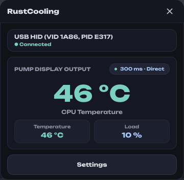
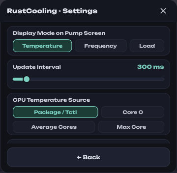
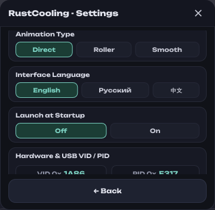
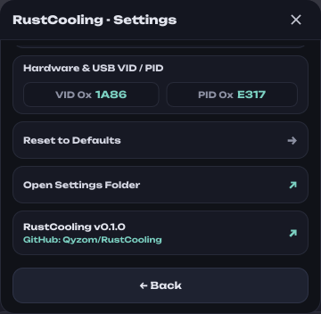

<div align="center">


# RustCooling

**Ultra-lightweight pump LCD display controller for ID-COOLING FX Series liquid coolers.**  
*100% Pure Rust • Native Linux & Windows • Zero Bloat • GUI (~12 MB) • TUI (~5 MB) • Daemon (~2 MB)*

[](LICENSE)
[](https://www.rust-lang.org/)
[](https://slint.dev/)
[](https://ratatui.rs/)
[]()
[](https://github.com/Qyzom/RustCooling/releases)

<br/>



<br/><br/>





</div>

---

### Author's Note

> [!NOTE]
> I made this project solely **for myself** to purge heavy, bloated vendor software from my personal computer. Chances are few people will ever see this repository, and that's completely fine with me.
>
> In reality, the ID-COOLING FX display protocol is **as primitive as it gets**: the display controller fundamentally only understands two real commands — screen on/off (`0x04`) and sending a numeric value to the 7-segment display (`0x01`). Everything else (frequency, mythical registers) doesn't change anything in the physical hardware. The entire RustCooling app is simply a very lightweight, clean, and convenient wrapper around this protocol.
>
> Whether you prefer a sleek hardware-accelerated GUI, a minimalist **Ratatui TUI dashboard** in your terminal (~5 MB RAM), or a silent background **systemd daemon** (~2 MB RAM), RustCooling covers all deployment styles out of the box.

---

### Key Features (Missing in the Official Vendor App)

1. **Interactive Terminal UI (TUI) Mode (~4–7 MB RAM):**  
   Run `rustcooling tui` or `rustcooling -t` for a minimalist, distraction-free terminal dashboard powered by `ratatui`. Features real-time CPU telemetry gauges, edge-to-edge history sparklines, full runtime settings editor, and 5-language localization. Mouse wheel events are ignored so scrolling never accidentally changes your settings.
2. **Headless Daemon Mode (~2–4 MB RAM) & Seamless Terminal Detachment:**  
   When closing the terminal running TUI, RustCooling automatically catches `SIGHUP` and hands off monitoring to a detached background daemon without powering off your pump screen. Alternatively, run `rustcooling daemon` or enable the included systemd user service.
3. **One-Shot Status Query for Status Bars:**  
   Run `rustcooling status` to instantly query the pump connection state, current CPU temperature, load, and display output in JSON or human-readable format for Waybar, Polybar, i3status, or Conky without holding any locks.
4. **Temperature Smoothing & Jitter Filtering:**  
   In the official vendor software, pump numbers jump wildly with every single 1-degree fluctuation. RustCooling features an exponential moving average + deadband hysteresis filter (0–5°C): minor fluctuations are filtered out, leaving a stable, non-distracting reading on your pump.
5. **Memory Footprint ~12–14 MB (In Tray < 3 MB):**  
   The vendor utility is built on Electron / Node.js and eats up 200–300 MB of RAM. RustCooling is written in 100% pure native Rust with Slint UI and consumes 20–50x less memory.
6. **True Native Linux Support:**  
   The vendor does not support Linux at all. RustCooling reads system sensors natively through the Linux kernel (`/sys/class/hwmon` and `/proc/stat`) without Wine, root permissions, or third-party background daemons.
7. **Direct Native Silicon Telemetry (Intel DTS & AMD Ryzen Zen 1–5):**  
   Zero WMI overhead, 0.0% background CPU, and pinpoint accuracy directly from silicon registers.
   - **Windows (Direct MSR & SMN Mailbox):** Reads real Intel Digital Thermal Sensors (DTS per-core & Package) via IA32 MSRs (`0x19C`, `0x1B1`) and AMD Ryzen (Zen 1–5) Tctl & CCD temperatures via PCI SMN indirect mailbox (`0:0.0`). Uses an embedded micro-driver with full security hardening: on-demand service execution (`SERVICE_DEMAND_START`), exclusive device handle, and guaranteed automatic kernel memory unloading upon exit.
   - **Linux (Driverless Native Kernel sysfs):** Telemetry is read natively via standard `/sys/class/hwmon` interfaces (`k10temp`, `zenpower`, `coretemp`) and `/proc/stat` without root permissions.
8. **Instant Cold Start (< 50 ms):**  
   No heavy runtimes or framework loading — the application launches instantaneously.
9. **Completely Standalone, Portable & Clean:**  
   Single self-contained binary with zero external runtime dependencies. Configuration (`config.json`) and driver files are kept strictly alongside the executable on Windows or in `~/.config/RustCooling/config.json` on Linux.

> [!NOTE]
> **Regarding ARM Architecture Support:**  
> ID-COOLING FX240/280/360 liquid coolers are designed exclusively for standard desktop motherboard sockets: Intel (LGA1700/1851/1200) and AMD (AM4/AM5) connecting via an internal 9-pin USB header. Desktop motherboards on ARM featuring AIO liquid cooling mounts do not exist on the consumer market, which is why ARM support was intentionally omitted to preserve codebase efficiency and eliminate dead code.

---

### Comparison with Alternatives

| Feature | Official Vendor Software | idc-lite (My Previous C# App) | **RustCooling (Rust)** |
| :--- | :---: | :---: | :---: |
| **Tech Stack** | Electron / Node.js + C++ | C# / .NET 8 (WPF) | **100% Pure Rust + Slint & Ratatui** |
| **RAM (GUI Active Window)** | ~200 – 300 MB | ~120 MB | **~12 – 14 MB** |
| **RAM (Interactive TUI)** | ❌ N/A | ❌ N/A | **~4 – 7 MB** |
| **RAM (Headless Daemon)** | ❌ N/A | ❌ N/A | **~2 – 4 MB** |
| **RAM (System Tray)** | ~200 MB | ~110 MB | **< 3 MB** (~1.1 – 2.5 MB) |
| **Background CPU Load** | 2.0% – 5.0% | ~1.0% | **0.0%** (Event-driven) |
| **Temp Jitter Smoothing** | ❌ None (jitters constantly) | ❌ None | **✔ Yes (configurable hysteresis filter)** |
| **Linux Support** | ❌ None | ⚠️ Experimental | **✔ Native (hwmon, sysfs, udev)** |
| **Startup Time** | 3.0 – 6.0 sec | 1.5 – 3.0 sec | **< 50 ms** |
| **UI Languages** | EN, ZH | EN, RU, ZH | **EN, RU, ZH, DE, FR** |

---

### Command Line Interface (CLI)

Once installed, the `rustcooling` command is accessible globally:

```bash
# Launch Graphical User Interface (Slint OpenGL window)
rustcooling

# Launch Interactive Terminal User Interface (Ratatui TUI dashboard)
rustcooling tui         # or: rustcooling -t

# Launch background headless daemon (~2 MB RAM)
rustcooling daemon      # or: rustcooling -d

# Non-blocking live telemetry status query (Waybar / Polybar / scripts)
rustcooling status      # or: rustcooling -s

# Graceful shutdown (powers off pump display and stops daemon)
rustcooling stop
```

---

### Quick Start

Pre-built binaries are available on the [**Releases**](https://github.com/Qyzom/RustCooling/releases/latest) page.

#### Windows (Portable)
1. Download **[`RustCooling-1.0.3.exe`](https://github.com/Qyzom/RustCooling/releases/latest)**.
2. Place it in any folder of your choice (e.g. `C:\Tools\RustCooling\`). Configuration (`config.json`) and the micro-driver will reside directly next to it.
3. On first run, the activation screen will appear: click **"Grant Rights & Install"** (UAC) to register the LibreHardwareMonitor sensor driver once.
4. Click **"Continue"** — the application is ready to use! System autostart is available in Settings.

#### Linux (Universal AppImage — All Distributions)
```bash
chmod +x RustCooling-1.0.3.AppImage
./RustCooling-1.0.3.AppImage
```

#### Linux (Debian / Ubuntu / Linux Mint)
```bash
sudo dpkg -i RustCooling-1.0.3.deb
```
*(Installs `/usr/bin/rustcooling`, udev rules for non-root USB pump access, desktop shortcut, and systemd user unit automatically).*

#### Linux (Fedora / Arch Linux / Generic Tarball)
```bash
tar -xzf RustCooling-1.0.3.tar.gz
cd RustCooling-1.0.3
sudo ./install.sh
```

#### Linux Systemd User Service (Background Daemon)
To run RustCooling silently in the background on every user login without GUI/TUI windows:
```bash
systemctl --user enable --now rustcooling
```

---

### Hardware Protocol Specification (USB HID)

- **Vendor ID (VID):** `0x1A86` (QinHeng Electronics / WCH)
- **Product ID (PID):** `0xE317`
- **Report Length:** 64 bytes (on Windows, Report ID `0x00` is prepended -> 65 bytes total).

#### Frame Structure (64 bytes)
```
[0x55, 0xBB, 0x02, CMD, VAL_HI, VAL_LO, CKSUM, 0x00 x 57]
```
- `0x55, 0xBB`: Magic bytes signature.
- `0x02`: Value payload length (2 bytes).
- `CMD`: Command opcode.
- `VAL_HI, VAL_LO`: Big-Endian `u16` numeric value.
- `CKSUM`: Checksum of the first 6 bytes `(sum(0..5)) & 0xFF`.
- Remaining 57 bytes: Zero padding (`0x00`).

#### Command Table
| Command | Hex | Description |
| :--- | :---: | :--- |
| `CMD_TEMPERATURE` | `0x01` | Number rendered on 7-segment display (CPU Temperature or CPU Load) |
| `CMD_SHOW` | `0x04` | Turn display panel on (`0x0001`) or off (`0x0000`) |

---

### Building from Source

```bash
git clone https://github.com/Qyzom/RustCooling.git
cd RustCooling
cargo test
cargo build --release
```
The compiled binary will be located in `target/release/RustCooling.exe` (Windows) or `target/release/RustCooling` (Linux).

---

### License & Third-Party Components

This project is licensed under the open-source **[MIT License](LICENSE)**.

Third-party open-source components and their respective licenses:
- **RustCooling Core & UI:** [MIT License](LICENSE) © Qyzom & Contributors.
- **Unbounded Font:** [SIL Open Font License 1.1](assets/fonts/OFL.txt) (Authors: Lexend & Contributors).
- **Noto Sans SC Font:** [SIL Open Font License 1.1](https://openfontlicense.org/) (Authors: Google LLC, Adobe Systems Inc.). Provides native Chinese character rendering.
- **LibreHardwareMonitor Driver:** [Modified BSD License](http://openlibsys.org/) (Author: Noriyuki Miyazaki / OpenLibSys / LibreHardwareMonitor). Provides safe physical hardware sensor access on Windows.
